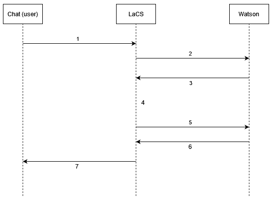

# About
This document explains how the Internal Messages System between Botbuilders & LaCS functions.

# How it works
;

When a user messages the bot, this message is sent to LaCS (1) and later to BotBuilders (2).
When receiving the message, BotBuilders can respond with any output (3) (Text, Options, etc) based on it's configuration.
Here is where the internal messages are implemented.
This type of messages/outputs allows LaCS to execute internal procedures (4) and "answer back" the result to BotBuilders (5) without sending any message to the user.
The internal procedures results are stored inside the `internalMessageResponse` context.

Once BotBuilders "sends" an internal message (3) it has to wait for a response (5). To do so, a new node with "Jump and Wait for user input" has to be added to the flow.

## Structure

### Internal message output


```json
{
  "output": {
    "generic": [
	    ...
    ],
    "snappy": [
	    ...
   	],
    "internalMessage": {
      "responseId": "Internal message output ID",
      "messages": [
        {
          "type": "internalMessageType1",
          "payload": "Internal Message Payload"
        },
       ...
        {
          "type": "internalMessageTypeN",
          "payload": "Internal Message Payload"
        }
      ]
    }
  }
}
```

### Internal Message Response

```json
{
	"internalMessageResponse": {
		"internalMessageType1": { ... }
		...
		"internalMessageTypeN": { ... }
	}
}
```


# Internal Messages VS Webhook
Internal Messages and Webhooks can be used for the same things and achieve the same goals. Yet there is a big difference, timing:
**Watson's Webhooks feature has an internal restriction in which the response has to be given under 8 seconds. The internal messages system doesn't have this restriction**
